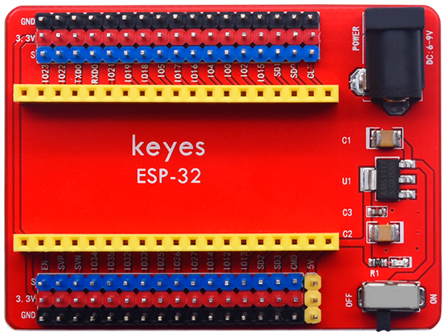
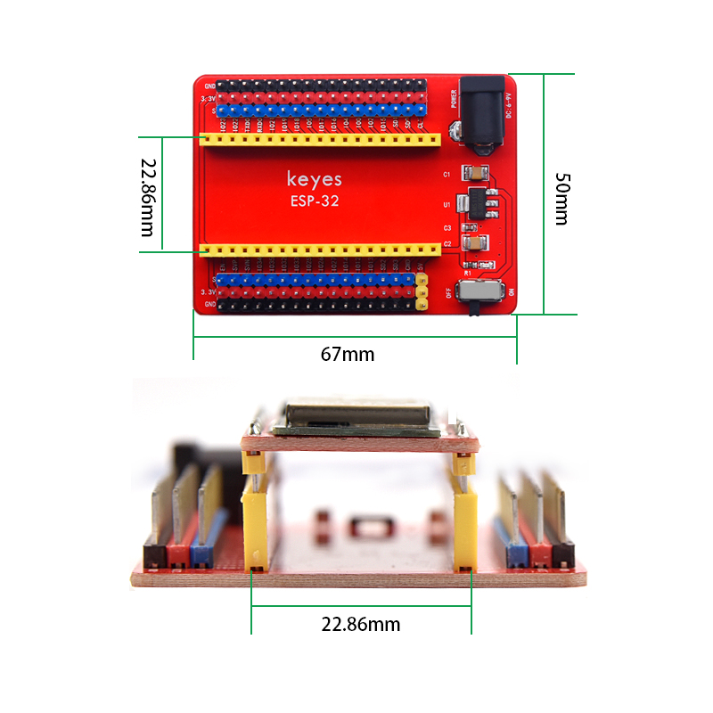
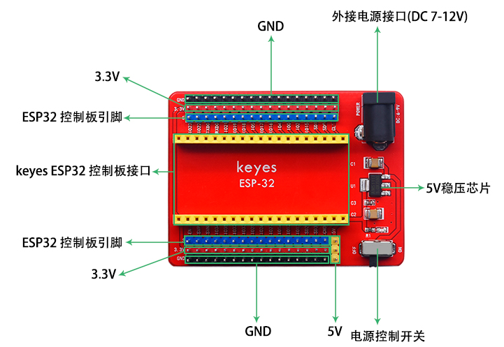
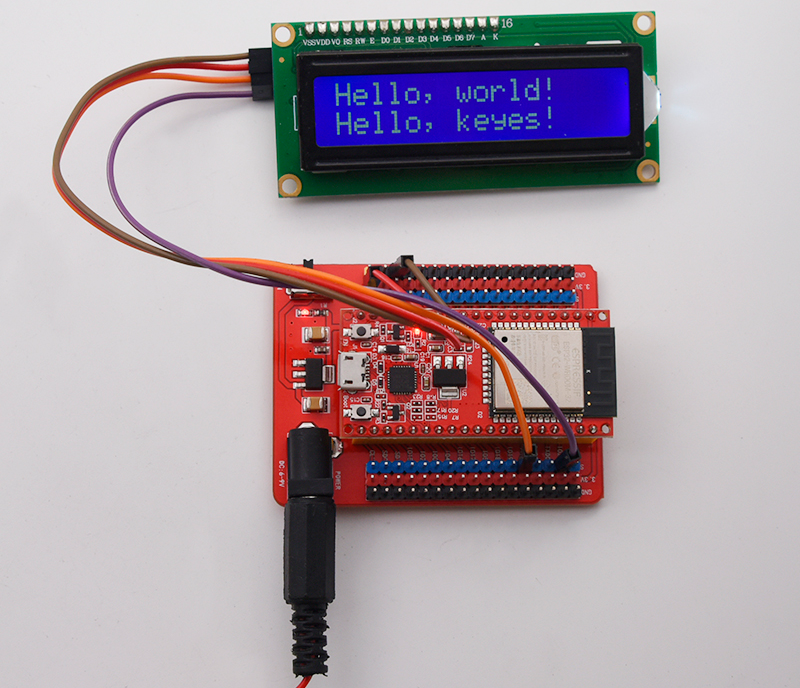

# KE0153 KEYES ESP32-IO扩展板

---

## 1. 说明
**KEYES ESP32-IO扩展板** 是一款专为兼容 KEYES ESP32 Core board（KE0162）而设计的扩展板。该扩展板将 KEYES ESP32 Core board 所有引脚连接，并利用间距为 2.54mm 的排针引出，方便用户进行各种连接。

扩展板上还自带 2 排间距为 2.54mm 的排针，用于给外接传感器/模块提供 DC 3.3V 电压供电。同时，为了方便给 KEYES ESP32 Core board 供电，控制板上设计了供电电路。用户只需在黑色 DC 头上输入 DC 7-12V 电压，即可给 KEYES ESP32 Core board 供电。此外，扩展板上还自带 1 个拨码开关，用于控制电源开关。

---

## 2. 技术参数
- **供电电压**：DC 7-12V  
- **工作电流**：60mA  
- **最大功率**：0.3W  
- **工作温度**：-25℃ 到 +65℃  
- **尺寸**：67mm × 50mm
- **重量**：23g  
- **环保属性**：ROHS  

---

## 3. 接口和主要元件说明
- **DC 供电接口**：用于输入 DC 7-12V 电压，为扩展板和 ESP32 Core board 供电。
- **排针接口**：所有引脚通过 2.54mm 排针引出，方便连接外部设备。
- **3.3V 电源输出**：为外接传感器/模块提供 DC 3.3V 电压。
- **拨码开关**：用于控制电源的开关状态。

---

## 4. 连接示例

以下是 KEYES ESP32-IO 扩展板与 KEYES ESP32 Core board 的接线示意图：

1. 将 DC 供电接口连接到 DC 7-12V 电源；
2. 将 3.3V 输出连接到外接传感器或模块；
3. 将排针接口连接到 KEYES ESP32 Core board。

---

## 5. 注意事项
1. **电源输入**：确保输入电压在 DC 7-12V 之间，避免损坏扩展板和 ESP32 Core board。
2. **连接牢固**：在插拔杜邦线时，确保连接牢固，避免接触不良。
3. **温度范围**：确保工作环境温度在 -25℃ 到 +65℃ 之间。
4. **拨码开关**：使用拨码开关时，确保开关状态正确，以免影响供电。

---

## 6. 参考链接
- **ESP32 官方文档**  
  - [ESP32 官方](https://www.espressif.com/en/products/socs/esp32)  
- **Keyes 相关**  
  - [Keyes 官网](http://www.keyes-robot.com/)  
- **开发辅助**  
  - [Arduino IDE 下载](https://www.arduino.cc/en/software)  
  - [ESP32 开发指南](https://docs.espressif.com/projects/esp-idf/en/latest/esp32/get-started/index.html)  
