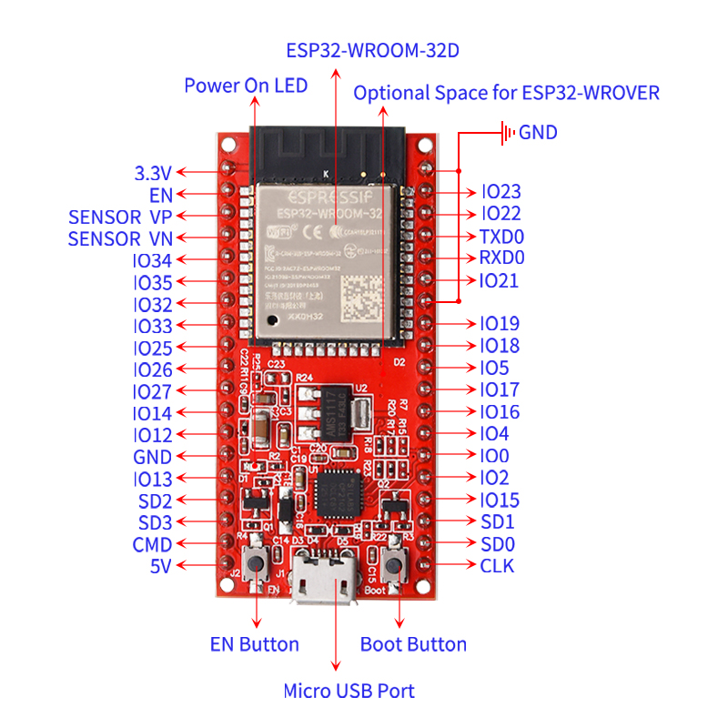

# KE0162 Keyes ESP32 Core Board 红色 环保


## 1. 说明
**Keyes ESP32 Core Board** 是基于 ESP-WROOM-32 模块设计的迷你开发板。该开发板引出大部分 I/O 至两侧的 2.54mm 间距的排针，开发者可以根据自己的需求连接外设。使用开发板进行开发和调试时，两侧的标准排针可以让操作更加简洁方便。ESP-WROOM-32 模块是业内集成度领先的 WiFi + 蓝牙解决方案，外部元器件少于 10 个，集成了天线开关、射频 balun、功率放大器、低噪放大器、过滤器和电源管理模块，安全可靠，易于扩展至各种应用。

---

## 2. 规格参数
- **微控制器**：ESP-WROOM-32 模块  
- **USB 转串口芯片**：CP2102-GMR  
- **工作电压**：DC 5V  
- **工作电流**：80mA（平均）  
- **供电电流**：500mA（最小）  
- **工作温度范围**：-40°C ~ +85°C  
- **WiFi 模式**：Station/SoftAP/SoftAP+Station/P2P  
- **WiFi 协议**：802.11 b/g/n/e/i（802.11n，速度高达 150 Mbps）  
- **WiFi 频率范围**：2.4 GHz ~ 2.5 GHz  
- **蓝牙协议**：符合蓝牙 v4.2 BR/EDR 和 BLE 标准  
- **尺寸**：55mm × 26mm  
- **重量**：10g左右

---
## 3. 接口图示



## 4. 接口说明


| 接口/元件 | 说明 |
|-----------|------|
| IO23     | VSPI MOSI/SPI MOSI |
| IO22     | Wire SCL |
| TXD0     | IO1/Serial TX |
| RXD0     | IO3/Serial RX |
| IO21     | Wire SDA |
| IO19     | VSPI MISO/SPI MISO |
| IO18     | VSPI SCK/SPI SCK |
| IO5      | VSPI SS/SPI SS |
| IO4      | ADC10/TOUCH0 |
| IO0      | ADC11/TOUCH1 |
| IO2      | ADC12/TOUCH2 |
| IO15     | HSPI SS/ADC13/TOUCH3/TDO |
| SD1      | IO8/FLASH D1 |
| SD0      | IO7/FLASH D0 |
| CLK      | IO6/FLASH SCK |
| CMD      | IO11/FLASH CMD |
| SD3      | IO10/FLASH D3 |
| SD2      | IO9/FLASH D2 |
| IO13     | HSPI MOSI/ADC14/TOUCH4/TCK |
| IO12     | HSPI MISO/ADC15/TOUCH5/TDI |
| IO14     | HSPI SCK/ADC16/TOUCH6/TMS |
| IO27     | ADC17/TOUCH7 |
| IO26     | ADC19/DAC2 |
| IO25     | ADC18/DAC1 |
| IO33     | ADC5/TOUCH8 |
| IO32     | ADC4/TOUCH9 |
| IO35     | ADC7 |
| IO34     | ADC6 |
| SENSOR VN| IO39/ADC3 |
| SENSOR VP| IO36/ADC0 |
| EN       | RESET |

---

---

## 5. 详细使用方法

### 5.1 下载安装 Arduino IDE
在使用控制板编程开发时，需要安装 Arduino IDE。可以在 Arduino 官网下载，链接为 [Arduino IDE 下载](https://www.arduino.cc/en/Main/OldSoftwareReleases#1.5.x)。选择适合自己操作系统的版本进行下载。

### 5.2 安装驱动文件
该控制板使用的 USB 转串口芯片为 CP2102-GMR。一般情况下，插上 USB 后，电脑会自动识别并安装驱动。如果驱动未成功安装，可以手动安装：
1. 打开设备管理器，找到 CP2102 的驱动。
2. 右键点击图标，选择更新驱动。
3. 浏览计算机查找驱动程序，选择 Arduino 开发软件中的 `DRIVERS` 文件夹，完成驱动安装。

### 5.3 ESP32 环境搭建 (Arduino)
1. 打开 Arduino IDE，进入 `File` -> `Preferences`。
2. 在 `Additional Board Manager URLs` 中添加以下链接：
   ```
   https://dl.espressif.com/dl/package_esp32_index.json
   ```
3. 进入 `Tools` -> `Board` -> `Boards Manager`，搜索 `esp32`，安装 `esp32 by Espressif Systems`。

### 5.4 Arduino IDE 设置和工具栏介绍
1. 打开 Arduino IDE。

2. 在 `Tools` 菜单中选择正确的板名称（如 ESP32 Dev Module）。

	

3. 选择正确的 COM 口（安装驱动成功后可看到对应 COM 口）。

	

4. 工具栏功能：
   
   
   
   - A: 检查编译错误
   - B: 上传程序到控制板
   - C: 创建新草图
   - D: 打开示例草图
   - E: 保存草图
   - F: 打开串行监视器

### 5.5 测试控制板
上传以下测试代码：
```cpp
#include "WiFi.h"

void setup() {
    Serial.begin(115200);
    WiFi.mode(WIFI_STA);
    WiFi.disconnect();
    delay(100);
    Serial.println("Setup done");
}

void loop() {
    Serial.println("scan start");
    int n = WiFi.scanNetworks();
    Serial.println("scan done");
    if (n == 0) {
        Serial.println("no networks found");
    } else {
        Serial.print(n);
        Serial.println(" networks found");
        for (int i = 0; i < n; ++i) {
            Serial.print(i + 1);
            Serial.print(": ");
            Serial.print(WiFi.SSID(i));
            Serial.print(" (");
            Serial.print(WiFi.RSSI(i));
            Serial.print(")");
            Serial.println((WiFi.encryptionType(i) == WIFI_AUTH_OPEN) ? " " : "*");
            delay(10);
        }
    }
    Serial.println("");
    delay(5000);
}
```
**注意**：上传时按住 BOOT 启动按钮，直到上传成功。上传后，打开串口监视器，设置波特率为 115200，即可看到各个 WiFi 信息。


---

## 6. 相关资料链接
- [KEYES 官方网站](http://www.keyes-robot.com)  
- [Arduino 官方网站](https://www.arduino.cc)  
- [ESP32 开发文档](https://docs.espressif.com/projects/esp-idf/en/latest/esp32/index.html)  
- [CP2102 驱动下载](https://www.silabs.com/developers/usb-to-uart-bridge-vcp-drivers)  
