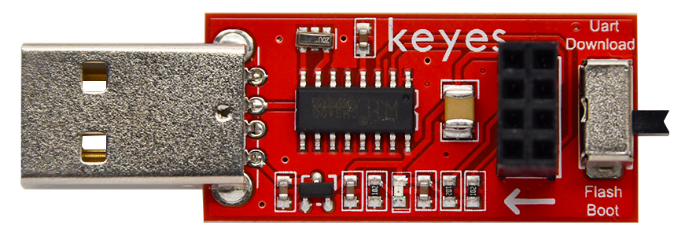
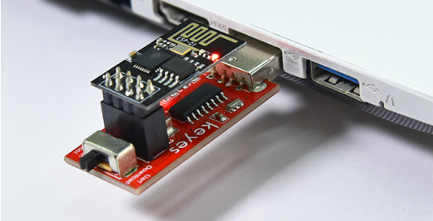
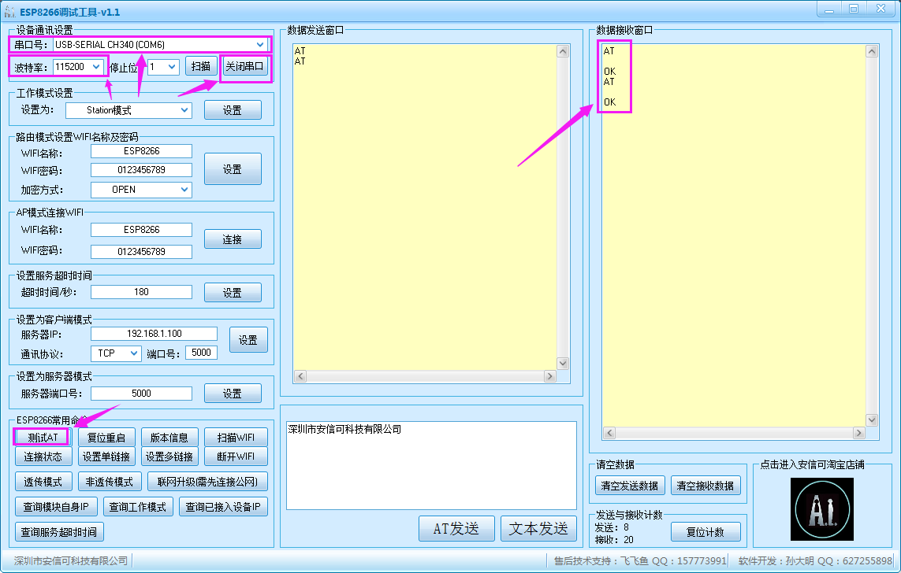
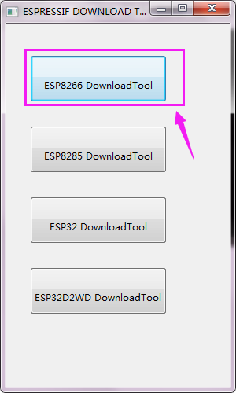
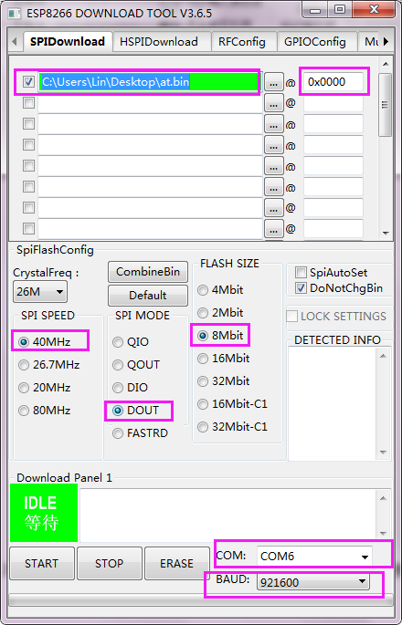
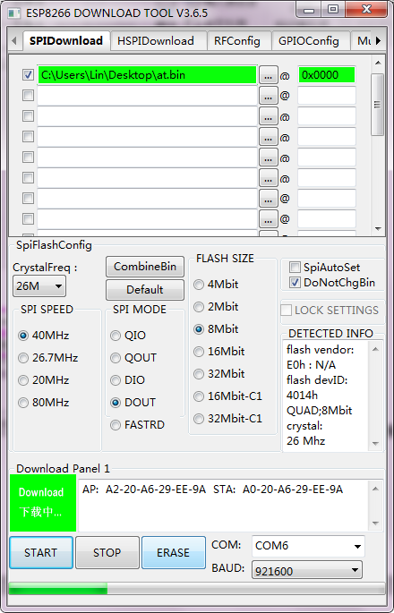
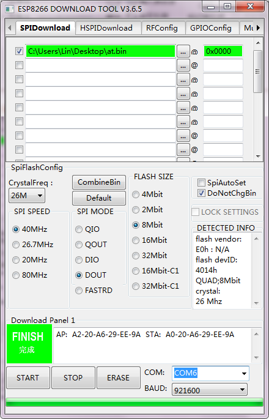
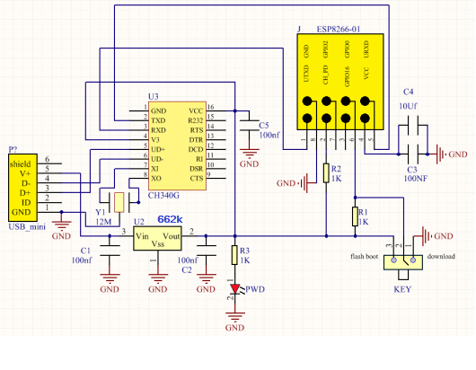

# KE0168 Keyes USB转ESP-01S WIFI模块串口测试扩展板

---

**说明**  
**Keyes USB转ESP-01S WIFI模块串口测试扩展板** 是一款专为 ESP-01S WiFi 模块设计的扩展板。该扩展板集成了 CH340G USB 转串口芯片，支持通过 USB 连接电脑进行 AT 指令测试和固件烧录。用户可以通过拨动开关选择不同的工作模式，方便进行调试和开发。

---

**技术参数**  
- **工作电压**：DC 5V  
- **工作电流**：最小 500mA  
- **环保属性**：ROHS  
- **通信电压**：3.3V  
- **尺寸**：55mm × 18mm × 12mm  
- **重量**：5.6g  

---

**安装驱动方法**  
该扩展板使用的 USB 转串口芯片为 CH340G，安装驱动的步骤如下：

1. 将扩展板连接到电脑的 USB 端口。
2. 右键点击“计算机” → “属性” → “设备管理器”，找到“USB2.0-Serial”。
3. 右键点击“USB2.0-Serial”，选择“更新驱动程序软件”。
4. 选择“浏览我的计算机以查找驱动程序软件”。
5. 找到驱动文件夹，点击“下一步”。
6. 完成安装后，点击“关闭”。
7. 重新进入“设备管理器”，确认 CH340 驱动安装成功，并查看对应的 COM 口。

如果需要更改 COM 口，方法如下：
1. 右键点击“计算机” → “属性” → “硬件设备”。
2. 右键点击对应的 COM 口，选择“属性”。
3. 进入“端口设置” → “高级”。
4. 选择小于 COM10 的 COM 口（如 COM6），点击“确定”。
5. 点击“是”确认更改。

---

**使用方法**  

**AT指令设置方法**  
1. 将 ESP8266 WIFI 模块（KS0339）直接连接到电脑 USB 端口，拨码开关拨到 **Flash Boot** 端。

	

2. 打开 ESP8266 调试工具，选择波特率为 115200，点击打开串口。

3. 点击测试 AT 指令，数据接收窗口会输出 OK，其他 AT 设置方法类似。

	

**固件的烧录方法**  
1. 将 ESP8266 WIFI 模块（KS0329）直接连接到电脑 USB 端口，拨码开关拨到 **Uart Download** 端。

	

2. 打开 flash_download_tools_v3.6.5 软件，点击开始。

3. 等待出现设置界面，按照要求设置烧录固件的地址。

	

4. 点击开始，模块会进入下载模式，完成固件安装后即可进行 AT 指令设置。

	

---

**原理图**

---

**相关资料链接**  
- [Keyes 官方网站](http://www.keyes-robot.com)  
- [CH340G 驱动下载](http://www.wch.cn/downloads/CH341SER_ZIP.html)  
- [ESP8266 官方文档](https://docs.espressif.com/projects/esp8266-rtos-sdk/en/latest/)  
- [Arduino ESP8266 库](https://github.com/esp8266/Arduino)  
