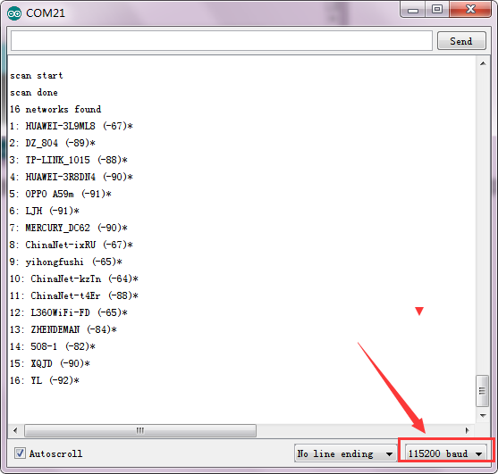

# KE0173 Keyes ESP8266 WiFi 开发板综合指南


---

## 1. 介绍
Keyes ESP8266 WiFi 开发板的处理器核心是 ESP8266-12F WiFi 模块。该模块由安信可科技开发，集成了业界领先的 Tensilica L106 超低功耗 32 位微型 MCU，主频支持 80 MHz 和 160 MHz，支持 RTOS，集成 Wi-Fi MAC/BB/RF/PA/LNA，板载天线。这个开发板是一个独立的网络控制器，可以为现有的设备添加联网功能。使用时可以通过 Micro USB 线供电和上传测试代码，供电时 Micro USB 线的电流需要 1A。

---

## 2. 特点
- **高集成度**：集成 Wi-Fi 功能，支持多种网络协议。
- **低功耗**：适合物联网应用，功耗低。
- **易于使用**：兼容 Arduino IDE，支持丰富的库和示例代码。
- **灵活性强**：可用于多种应用场景，如智能家居、环境监测等。

---

## 3. 规格参数
- **主控芯片**：ESP8266-12F  
- **VIN 输入电压**：5-12V  
- **运行电压**：DC 3.3V  
- **3.3V 最大输出电流**：800mA  
- **主频支持**：80 MHz 和 160 MHz  
- **模拟信号输入脚**：1 (A0)  
---

## 4. 工作原理
ESP8266 模块通过 Wi-Fi 连接到网络，能够发送和接收数据。它可以作为客户端连接到 Wi-Fi 网络，也可以作为热点供其他设备连接。通过编程，用户可以控制模块的行为，实现数据采集、设备控制等功能。

---

## 5. 接口
- **电源接口**：VIN（5-12V），GND（接地）
- **串口通信接口**：RX（接收），TX（发送）
- **SPI 通信接口**：S1（MOSI）、SC（CS）、S0（MISO）、SK（SCLK）
- **HSPI 通信接口**：D5（HSCLK）、D6（HMISO）、D7（HMOSI）、D8（HCS）
- **模拟输出接口**：A0
- **GPIO 接口**：D0（GPIO16）、D1（GPIO5）、D2（GPIO4）、D3（GPIO0）、D4（GPIO2）、D5（GPIO14）、D6（GPIO12）、D7（GPIO13）、D8（GPIO15）、RX（GPIO3）、TX（GPIO1）、S3（GPIO10）、S2（GPIO9）


---

## 6. 连接图


### 连接示例
- 将 VIN 引脚连接到 5V 电源。
- 将 GND 引脚连接到地。
- 将 RX 和 TX 引脚连接到 Arduino 的相应引脚。

---

## 7. 下载安装 Arduino IDE
在使用控制板编程开发时，我们需要安装 Arduino IDE。可以在 Arduino 的官网中下载，链接为 [Arduino IDE 下载](https://www.arduino.cc/en/Main/OldSoftwareReleases#1.5.x)。里面有各个系统各个版本的 IDE。这个控制板只兼容 1.6.5 版本以后的 IDE。

### 下载步骤
1. 选择适合 Windows 系统的 1.6.5 版本 IDE。
2. 点击下载链接，下载完成后解压缩包。
3. 进入解压后的 `arduino-1.6.5-r5` 文件夹，准备使用。

---

## 8. 安装驱动文件
该控制板使用的 USB 转串口芯片为 CH340G，我们需要安装该芯片的驱动，驱动文件为 `usb_ch341_3.1.2009.06`。

### 安装步骤
1. 将驱动文件放到 D 盘。
2. 当 Keyes ESP8266 WiFi 开发板第一次接入电脑时，右击桌面上的“我的电脑” → “属性” → “设备管理器”，找到“USB2.0-Serial”。
3. 点击 “USB2.0-Serial”，选择“更新驱动程序软件”。
4. 点击“浏览计算机以查找驱动程序软件”，找到提供的“drivers”文件夹。
5. 安装完成后点击“关闭”。
6. 驱动安装完成后，右键点击“我的电脑” → “属性” → “设备管理器”，确认 CH340 驱动程序已成功安装。

---

## 9. Arduino for ESP8266 安装方法
将控制板用 USB 线连接到电脑，点击进入 `arduino-1.6.5-r5` 文件夹，找到图标点击进入 1.6.5 版本 IDE 界面。

### 安装步骤
1. 点击 `File` → `Preferences`，在“Additional Boards Manager URLs:”中复制以下地址：
   ```
   http://arduino.esp8266.com/stable/package_esp8266com_index.json
   ```
   然后点击确定保存这个地址。

   
   
2. 点击 `Tools` → `Board:`，进入 Boards Manager，IDE 会自动下载相关文件。

	

3. 下载成功后，在 All 后的空格中输入 `8266`，点击下面的搜索内容，点击 `Install` 开始安装相关插件。

	

4. 安装成功后点击 `Close` 关闭，然后点击 `Tools` → `Board:`，你可以在里面找到 ESP8266 板。

---

## 10. Arduino IDE 设置和工具栏介绍
1. 进入 `arduino-1.6.5-r5` 文件夹，打开 Arduino IDE。

2. 为了避免在将程序上传到板上时出现任何错误，必须选择正确的 Arduino 板名称。转到 `Tools` → `Board`，选择你的板。

	

3. 选择正确的 COM 口（安装驱动成功后可看到对应 COM 口）。

	

### 工具栏功能


- **A** - 检查是否存在任何编译错误。
- **B** - 将程序上传到控制板。
- **C** - 创建新草图的快捷方式。
- **D** - 直接打开示例草图之一。
- **E** - 保存草图。
- **F** - 从板接收串行数据并将串行数据发送到板的串行监视器。

---

## 11. 测试控制板
在打开 Arduino IDE 上传代码前，需要添加库文件，将 `ESP8266WiFi` 文件夹复制到 `libraries` 文件夹中（在 `arduino-1.6.5-r5` 文件中）。


### 上传测试代码
1. 点击进入界面开始上传测试代码，若没有添加库文件前已经打开 IDE，那么在添加库文件后，需要重启 IDE，库文件才有效果。

### 示例代码
```cpp
#include "ESP8266WiFi.h"

void setup() {
  Serial.begin(115200);

  // 设置 WiFi 为站点模式并断开之前连接的 AP
  WiFi.mode(WIFI_STA);
  WiFi.disconnect();
  delay(100);

  Serial.println("Setup done");
}

void loop() {
  Serial.println("scan start");

  // WiFi.scanNetworks 将返回找到的网络数量
  int n = WiFi.scanNetworks();
  Serial.println("scan done");
  if (n == 0) {
    Serial.println("no networks found");
  } else {
    Serial.print(n);
    Serial.println(" networks found");
    for (int i = 0; i < n; ++i) {
      // 打印每个找到的网络的 SSID 和 RSSI
      Serial.print(i + 1);
      Serial.print(": ");
      Serial.print(WiFi.SSID(i));
      Serial.print(" (");
      Serial.print(WiFi.RSSI(i));
      Serial.print(")");
      Serial.println((WiFi.encryptionType(i) == ENC_TYPE_NONE) ? " " : "*");
      delay(10);
    }
  }
  Serial.println("");

  // 等待一段时间后再次扫描
  delay(5000);
}
```

---

## 12. 实验现象
按照前面方法设置板和 COM 口，IDE 右下角显示对应板和 COM 口，然后上传测试代码，上传成功。

将代码上传到控制板后，打开串口监视器，设置波特率为 115200，即可看到各个 Wi-Fi 信息。



---

## 13. 注意事项
- 确保供电电压在 5-12V 范围内，避免损坏开发板。
- 在上传代码之前，确保选择正确的板和 COM 口。
- 使用合适的库（如 ESP8266WiFi 库）来简化 Wi-Fi 功能的实现。

---

## 14. 参考链接
- [Keyes 官方网站](http://www.keyes-robot.com)  
- [ESP8266 官方文档](https://arduino-esp8266.readthedocs.io/en/latest/)  
- [Arduino 官方网站](https://www.arduino.cc)  
